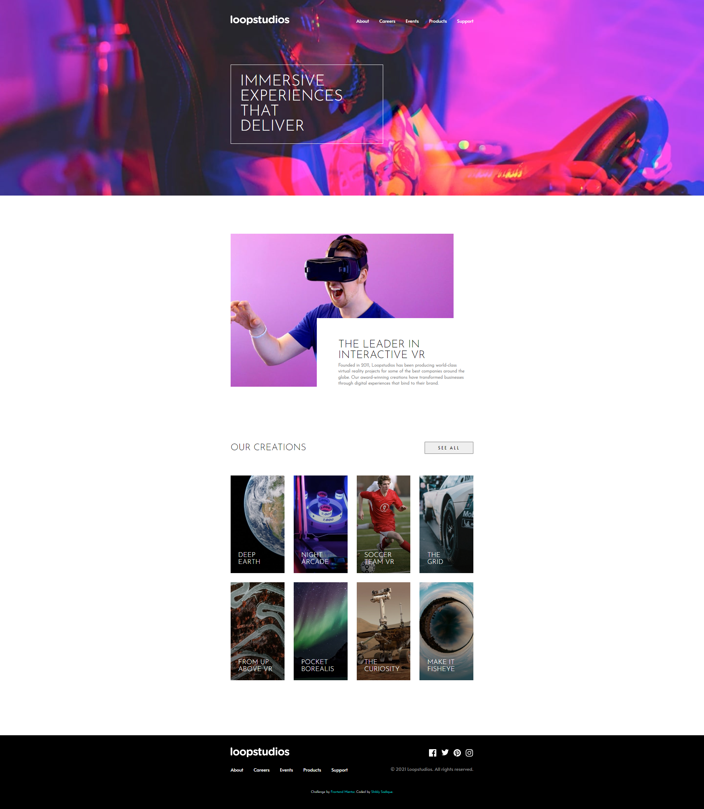

# Frontend Mentor - Loopstudios landing page solution

This is a solution to the [Loopstudios landing page challenge on Frontend Mentor](https://www.frontendmentor.io/challenges/loopstudios-landing-page-N88J5Onjw). Frontend Mentor challenges help you improve your coding skills by building realistic projects.

## Table of contents

- [Overview](#overview)
  - [The challenge](#the-challenge)
  - [Screenshot](#screenshot)
  - [Links](#links)
- [My process](#my-process)
  - [Built with](#built-with)
  - [What I learned](#what-i-learned)
  - [Continued development](#continued-development)
  - [Useful resources](#useful-resources)
- [Author](#author)

## Overview

### The challenge

Users should be able to:

- View the optimal layout for the site depending on their device's screen size
- See hover states for all interactive elements on the page

### Screenshot



### Links

- Live Site URL: [live site URL](https://shibly07.github.io/loopstudios_home-page/)

## My process

### Built with

- Semantic HTML5 markup
- CSS custom properties
- Flexbox
- CSS Grid
- JavaScript
- Mobile-first workflow

### What I learned

When adding cards in 'creations' section manually in SCSS, it looked bad. Found @each loop for SCSS and used it to add background image. Now new images in that section can be added by only using html and adding the image.

Adding opacity on hovering cards also changed the opacity of the card texts. Researched and added background images to the pseudo element so that only the opacity of the card element was changed but not the text in it.

SCSS code for adding background-images:

```scss
@each $card in $cards {
  &.#{$card} {
    position: relative;

    &::before {
      position: absolute;
      content: "";
      top: toRem(0);
      right: toRem(0);
      bottom: toRem(0);
      left: toRem(0);
      background-image: linear-gradient(
          0deg,
          rgba(0, 0, 0, 0.6),
          rgba(0, 0, 0, 0)
        ), url(../../images/desktop/image-#{$card}.jpg);
      background-repeat: no-repeat;
      background-size: cover;
      transition: all 300ms ease-in-out;
    }
  }
}
```

### Continued development

Many advanced properties such as @extend, @each etc. helped me shorten the code length and optimize it and also gave a good and professional look. I intend on researching and using more advanced properties in the code in future.

### Useful resources

- [Example resource 1](https://sass-lang.com/documentation/at-rules/extend) - This article saved me from adding a lot of classes in the html.

- [Example resource 2](https://sass-lang.com/documentation/at-rules/control/each) - This helped me to learn the functionality of @each rule and how to use it.

## Author

- LinkedIn - [Md Shibly Sadique Islam](https://www.linkedin.com/in/md-shibly-sadique-islam-092a10203/)
